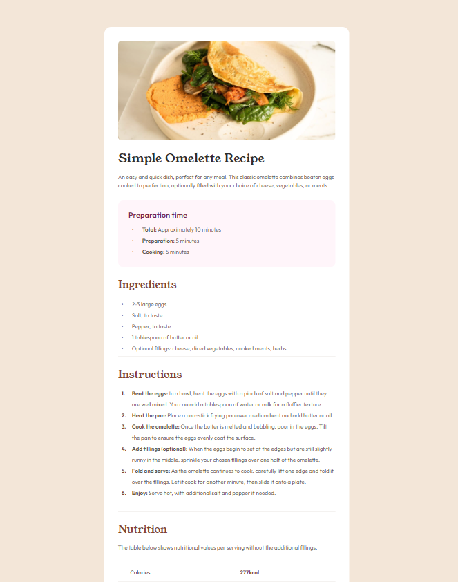

# Frontend Mentor - Страница рецепта

## Страница рецепта

Этот проект был выполнен в рамках задания от [Frontend Mentor](https://www.frontendmentor.io).

## Задание

Цель задания - создать страницу рецепта, следуя предоставленному дизайну. В рамках проекта я сосредоточился на:

- **Семантической верстке**: Использование семантических HTML-элементов для структурирования контента страницы.
- **Адаптивности**: Реализация адаптивного дизайна без использования медиа-запросов. Применение CSS-функций `clamp`, `calc`, процентов, единиц `viewport` и `rem` для гибкой адаптации элементов.
- **CSS-псевдоэлемента `before`**: Использование псевдоэлементов для стилизации и добавления контента.

## Использованные технологии

- **HTML5**: Для создания структуры и семантики страницы.
- **SCSS**: Для стилизации и управления стилями с использованием переменных, вложенности и функций `clamp` и `calc` для адаптивности.
- **CSS**: Скомпилированный из SCSS для окончательной стилизации страницы.

## Превью

### Для десктопных устройств

 - Full HD:\
    

 - Laptop:\
    

 - Laptop:\
    

 - 4K:\
    

### Для мобильных устройств

 - Mobile (320px):\
    

 - Mobile (320px):\
    

## Ссылки

- [Frontend Mentor - Страница рецепта](https://www.frontendmentor.io/challenges/recipe-page-KiTsR8QQKm)
- [Мой GitHub](https://github.com/Petrakoow)

